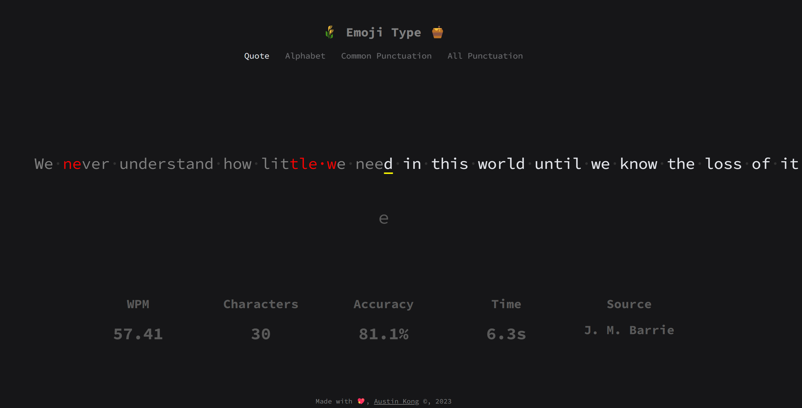

# Emoji Type 🥑
A typing test website for you to practice touch typing!
## About

### Description
Emoji Type, formerly Typing Test, is a simple, real-time, minimalist typing test website. Try it [here](https://austinkong.github.io/typing-test).
Features include:
* Real-time tracking of statistics, includes: WPM, characters, accuracy, time
* Accuracy and WPM calculations based on formula given in [Monkey Type](https://monkeytype.com)
* Different typing modes: quote, alphabet, common punctuation, all punctuation
* Quote fetching from [Quotable API](https://github.com/lukePeavey/quotable)
* Key tracking to see mispressed keys
* Easter eggs
### Technology
* HTML 5: Basic structure of the application
* CSS: Styles the visual components
* JavaScript: Logic
## Getting Started
### Deployment
Instructions for users:
1. Head to the [Github Pages website](https://austinkong.github.io/typing-test) to try it out
### Installation
Installation and setup instructions for developers:
1. Fork and clone the repository
2. Start coding and build something awesome!
### Contributing
This project is no longer under active development. Suggestions, issues and bug reports will not be actively resolved. However, pull requests and forks are always welcome!
## Authors
Austin Kong [@AustinKong](https://github.com/AustinKong)
## License
This project is licensed under MIT license. View license in [license.txt](license.txt)
